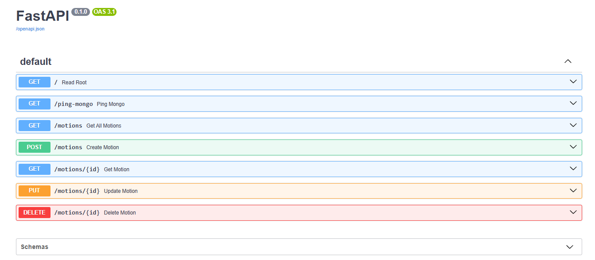

# 🚗 Monitoring Innovation - Backend

Este repositorio contiene el **backend** desarrollado en Python usando **FastAPI** y **MongoDB** para la gestión de un sistema CRUD.

## 📚 Documentación del API

La documentación interactiva de la API está disponible en:

- [http://localhost:8000/docs](http://localhost:8000/docs) (Swagger UI)

- [http://localhost:8000/redoc](http://localhost:8000/redoc) (ReDoc)

## ⚙️ Descripción técnica
Este backend fue desarrollado usando:
- **Python 3.13**
- **FastAPI**
- **Uvicorn** (para levantar el servidor)
- **Pydantic** (para validaciones)
- **Motor** (driver async para MongoDB)
- **MongoDB Atlas** 


## ✅ Requisitos previos
Antes de continuar, asegúrate de tener:

- Python instalado
- Base de datos MongoDB operativa (local o en la nube)
- Tener configurada la variable de entorno con la URL de conexión a MongoDB

> ❗No se incluyen instrucciones para instalar Python, MongoDB.


## ⚙️ Instalación del proyecto
---
Clona el repositorio:
 ```bash
    git clone https://github.com/TefaSalcedo/motion-backend.git
    cd motion-backend
   ```

Crea y activa un entorno virtual:
```bash
python -m venv venv
source venv/bin/activate  # En Windows: venv\Scripts\activate
```

Instala las dependencias:
```bash
pip install -r requirements.txt
```

Crea un archivo `.env` en la raíz con la configuración de tu base de datos MongoDB:
```bash
MONGO_URL=mongodb+srv://<usuario>:<contraseña>...
DATABASE_NAME=testdb
```

## 🚀 Ejecución en local

Inicia el servidor de desarrollo con:

```bash
uvicorn app.main:app --reload
```
Esto levantará la API en [localhost.](http://localhost:8000)


## Endpoints principales
- GET /motions → Obtener todos los registros
- GET /motions{id} → Obtener un registro por id
- POST /motions → Crear un nuevo registro
- PUT /motions/{id} → Actualizar un registro existente
- DELETE /motions/{id} → Eliminar un registro

>Todos los datos corresponden a una colección en MongoDB con los campos: marca, sucursal, aspirante.

## 🤝 Conexión con el frontend
Este backend fue diseñado para funcionar junto al frontend disponible en:

👉 [Repositorio Frontend](https://github.com/TefaSalcedo/motion-frontend)